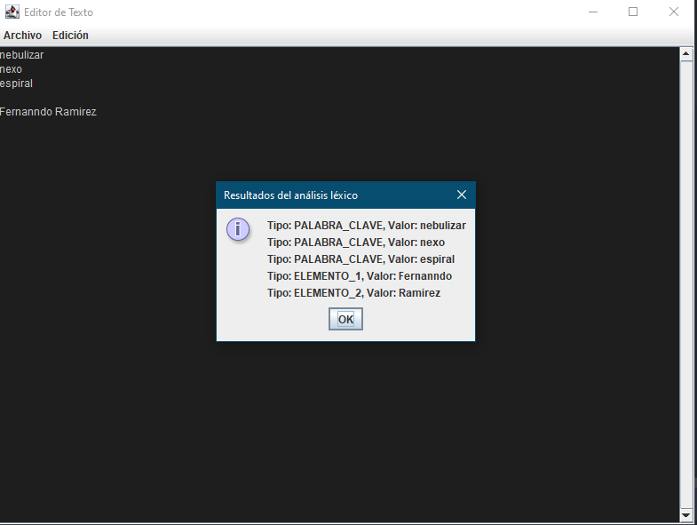

# Nebula Compiler

El Nebula Compiler es un proyecto de compilador desarrollado en Java para el lenguaje Nebula. Nebula es un lenguaje de programación estructurado, inspirado en C pero con una sintaxis más simple y legible similar a Python. Este proyecto también incluye un editor de texto integrado para facilitar el desarrollo en Nebula.

*Interfaz del Editor de Texto en modo oscuro*
## Características

- **Compilador de Nebula:** El compilador convierte el código fuente escrito en Nebula en código ejecutable.

- **Sintaxis Simple:** Nebula presenta una sintaxis simple y legible, lo que facilita la escritura y comprensión del código.

- **Basado en Java:** El compilador está desarrollado en Java, lo que permite su ejecución en múltiples plataformas.

- **Editor de Texto Integrado:** El proyecto incluye un editor de texto integrado para escribir y editar código Nebula de manera conveniente.

## Uso

1. **Clonar el Repositorio:** Clona este repositorio en tu máquina local utilizando el siguiente comando:
   
2. git clone https://github.com/tu_usuario/nebula-compiler.git
3. **Compilar el Proyecto:** Navega hasta el directorio del proyecto y compila el código Java utilizando:
4. **Ejecutar el Compilador:** Una vez compilado, puedes ejecutar el compilador Nebula con el siguiente comando:
   Reemplaza `<archivo_nebula>` con el nombre del archivo Nebula que deseas compilar.
5. **Utilizar el Editor de Texto:** Para utilizar el editor de texto integrado, simplemente ejecuta el archivo `Editor.java`. Esto abrirá la interfaz gráfica del editor donde puedes escribir y guardar tu código Nebula.

## Contribuir

Si deseas contribuir al desarrollo del Nebula Compiler, siéntete libre de enviar pull requests o abrir issues en este repositorio. ¡Toda contribución es bienvenida!

## Licencia

Este proyecto está bajo la Licencia MIT. Consulta el archivo [LICENSE](LICENSE) para más detalles.

